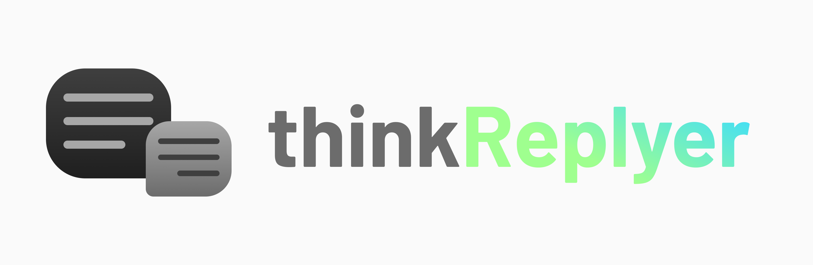

  

thinkReplyer is a pseudo AI model for [thinkerAI](https://github.com/thinking-grp/thinkerAI) developed by thinking-grp.

## Requirements
- thinkerAI V1

## Development schedule
|Date|Contents|
|----|--------|
|April 2023|Release v1.0.0 alpha version|
|May 2023|Release v1.0.0 beta version|
||Public testing on Misskey|
|June 2023|Release v1.0.0 stable version|